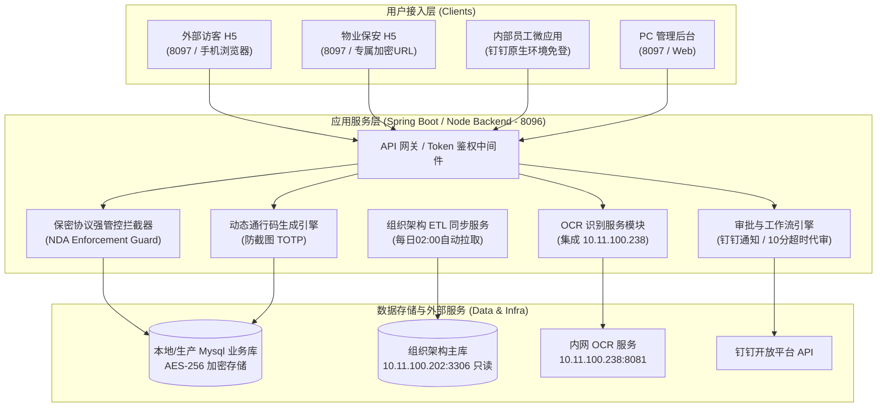
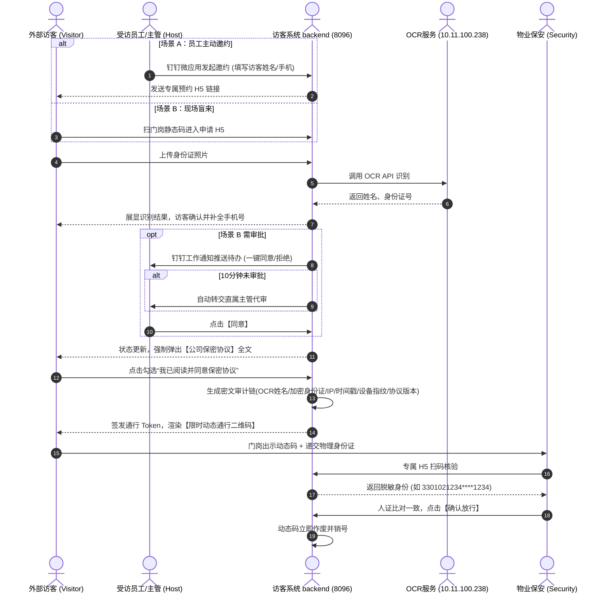

# 园区访客系统 (Visitor System) - 技术架构与系统设计方案

**拟制单位**：浙江脉通智造科技有限公司  
**文档版本**：V3.0.0 (纯Token免密驱动+批量邮件邀约+超时递进上报完备版)  
**发布日期**：2026年08月  
**当前状态**：全流程功能已部署上线并完成端到端验证  

---

## 1. 项目概述与设计目标

### 1.1 项目背景
浙江脉通智造科技有限公司作为医疗器械研发与制造企业，涉及核心工艺与商业机密。当前门岗采用传统纸质登记模式，存在以下严重痛点：
1. **身份核验流于形式**：无法实时校验真实身份，手写信息字迹潦草、易伪造；
2. **协同效率低下**：受访员工无法预知来访，保安电话逐一确认，沟通成本高；
3. **商业机密泄露风险**：手工登记无法强制要求来访人员签署具备法律效力的保密协议（NDA），缺乏举证追溯能力；
4. **敏感数据暴露与合规风险**：身份数据明文暴露在纸质登记簿上，无法做到隐私保护与数字化沉淀。

### 1.2 系统目标
建设打通“外部访客 (Visitor)”、“内部员工 (Host)”、“物业保安 (Security)”与“系统管理员 (Admin)”四方协同的智能化、轻量化免登访客系统。通过全线上化流程处理，将传统被动防御转变为主动预控。

---

## 2. 部署环境与基础资源配置

系统严格遵循多项目隔离与资源注册规范，端口与数据库资源配置如下：

### 2.1 端口分配规范 (Port Allocation)
已在全局端口注册表 (`global_port_registry.md`) 完成登记备案：
* **后端 API 服务端口**：`8096`
* **前端 H5 / Web 服务端口**：`8097`

### 2.2 管理员凭据与身份认证
* **管理员账号**：`admin`
* **管理员密码**：`Accupath@0723`
* **访问入口**：`http://IP:8097/admin`

### 2.3 部署模式与一键启动
* **Linux 生产环境**：提供容器化编排文件 `docker-compose.yml`，后端 (`visitor-backend`) 暴露 8096 端口，前端基于 Nginx (`visitor-frontend`) 暴露 8097 端口。
* **Windows 本地开发环境**：根目录下提供一键启动脚本 [`start-dev.ps1`](file:///d:/DEV/Visitor-System/start-dev.ps1)。

### 2.4 数据库部署架构 (Database Architecture)

* **组织架构主库 (10.11.100.202:3306)**：
  - **访问权限**：**严格只读 (Read-Only)**。
  - **主要作用**：提供企业人员、部门关系、上级主管等基础组织数据的单向 ETL 增量同步源。
* **本地测试/开发数据库 (Local Dev DB)**：
  - 本地 MySQL 实例，用于存储访客系统业务表（访客单、保密协议签署记录、系统配置、审计日志等）。
* **生产部署环境**：
  - 生产环境后续将统一部署于 `10.11.100.202` 服务器。

### 2.3 OCR 服务集成方案 (OCR Integration)
* **默认 OCR 服务地址**：`http://10.11.100.238:8081/ocr`（参考 `health-cert-system` 项目方案）。
* **核心识别逻辑**：支持上传身份证图片（或 Base64），自动提取姓名、身份证号、性别、住址等字段。
* **管理员可配置性**：
  - 系统后台数据库配置表 `system_config` 维护 `ocr.service.url`、`ocr.proxy.enabled` 及 `ocr.proxy.url`。
  - 管理员可在 Web 管理端界面动态修改 OCR 服务地址，支持网络故障时的后端代理转发与降级重试机制。

---

## 3. 系统整体技术架构设计

系统采用前后端分离架构，配合轻量级 H5 免登与钉钉微应用集成：

---

## 4. 业务核心流程与强管控设计

### 4.1 业务时序图 (Cross-Role Interaction)

系统包含两大业务场景：**场景A（员工主动预约邀约）** 与 **场景B（访客现场盲来扫码）**。在生成动态通行码前，系统均施加**保密协议强拦截**。

---

## 5. 关键技术点实现方案

### 5.1 在线保密协议强拦截机制 (NDA Enforcement)
1. **强流程阻断逻辑**：
   在后端 API 设计中，`POST /api/visitor/generate-pass-code` 接口必须强制校验 `visitor_record.nda_signed == 1`。若未完成勾选签署，后端直接拒绝下发通行 Token，前端保持锁定于协议签署界面。
2. **防篡改数据链存证 (Audit Trail Chain)**：
   数据库新建 `visitor_nda_records` 表，在访客点击确认时自动记录：
   - 访客 OCR 真实姓名；
   - 身份证号（AES-256 加密密文）；
   - 签署精确时间戳（`YYYY-MM-DD HH:mm:ss.SSS`）；
   - 客户端公网 IP 地址；
   - 手机设备指纹（User-Agent、屏幕分辨率等）；
   - 签署的保密协议版本号（如 `V1.0.0`）。
3. **版本控制与失效重签**：
   管理后台发布新版本协议（如 `V1.1.0`）时，历史签核状态自动对新到访失效，旧访客再次到访必须重新阅读并签署新版协议。

### 5.2 敏感数据安全与脱敏规范 (Data Security & Masking)
1. **落盘加密 (AES-256)**：
   数据库存储的访客身份证号、手机号、保密协议签署记录字段使用 AES-256 对称算法加密落盘。
2. **传输加密 (HTTPS TLS 1.3)**：
   全链路采用 HTTPS 传输加密。
3. **保安端强脱敏 (Masking Protection)**：
   保安端专属接口只返回中间 4 位遮蔽的身份证号（例如：`3301021234****1234`），且接口中彻底过滤保密协议文本与细节，确保保安无法触及商业与个人隐私数据。
4. **动态通行码防截图机制**：
   通行二维码由后端生成包含时间戳与随机 HMAC 的短时效 Token（如 30 秒有效），前端叠加水纹动效，防止截图私传。

### 5.3 组织架构 ETL 同步机制 (ETL Job)
* **数据源**：`10.11.100.202:3306` 主库（只读）。
* **同步策略**：每天凌晨 `02:00` 运行 Cron 增量 ETL 脚本，清洗并单向同步员工工号、姓名、部门、上级主管映射关系至访客系统本地库，保持企业级数据一致性。

---

## 6. 功能模块与权限矩阵

| 模块名称 | 访问渠道 | 核心功能点 | 安全与鉴权策略 |
| :--- | :--- | :--- | :--- |
| **外部访客端** | 手机浏览器 / H5 (端口 8097) | 身份证 OCR 拍摄识别、自动填充确认、选择受访人、在线签署保密协议、动态通行证展示 | 免登录；基于动态加密 Token 控制生命周期；未签署保密协议强行阻断 Token 下发。 |
| **内部员工端** | 钉钉微应用 (端口 8097/8096) | 主动填写预约表单、自动生成邀请链接、钉钉通知实时一键审批/驳回、10分钟超时转主管代审、查看访客协议签署状态 | 钉钉环境免登；强绑定本地同步的人员映射关系，越权拦截。 |
| **物业保安端** | 专属安全 URL / H5 (端口 8097) | 调用手机摄像头扫码核验、展示脱敏 4 位身份数据、一键确认放行与销号 | 免登录；专属 URL 包含安全时效 Token；界面强脱敏，协议数据对保安不可见。 |
| **后台管理端** | PC Web 浏览器 (端口 8097) | 系统全局配置、保密协议版本控制与文本维护、OCR 服务地址配置、组织架构同步日志监控、全量访客明文记录与协议签署审计日志追溯 | 管理账户强密码管控；配置登录限制；全量协议签署与修改操作实施不可逆审计留痕。 |

---

## 7. 开发与部署计划 (Implementation Plan)

1. **第一阶段：数据库与基础服务初始化**
   - 建立本地 MySQL 开发库表结构（包含 PII 加密字段与 NDA 审计链表）。
   - 配置与 `10.11.100.202` 只读主库的连接与增量 ETL 同步逻辑。
   - 配置本地/远程 OCR 服务（端口与 API 映射）。
2. **第二阶段：后端 API 与安全拦截中间件开发**
   - 编写 OCR 识别及降级处理模块。
   - 实现保密协议强拦截中间件（NDA Enforcement Middleware）。
   - 接入钉钉开放平台免登与工作通知 API。
3. **第三阶段：多端前端界面开发**
   - 访客 H5 端（OCR 拍照、保密协议签署弹窗、动态通行码渲染）。
   - 保安 H5 端（扫码脱敏核验、放行销号）。
   - 钉钉员工微应用（预约与待办卡片）。
   - PC 管理后台（系统配置、OCR 配置、协议版本控制与审计）。
4. **第四阶段：生产环境部署与验证**
   - 部署至 `10.11.100.202` 生产环境服务器（后端端口 8096，前端端口 8097）。
   - 进行完整场景 A 与场景 B 联调验证，完成压力测试与安全审计。
